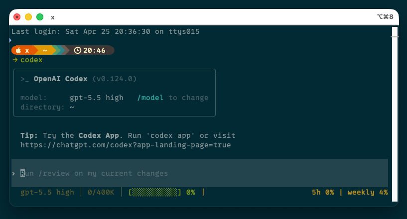

# Codex HUD

A statusline-style HUD for OpenAI Codex CLI sessions. Codex HUD keeps the important session signals visible: model, reasoning effort, context window usage, rate limits, git state, tools, agents, todos, and session metadata.

> 🌐 English | [中文文档](README.zh.md)

```text
gpt-5.5 high │ 96.5K/258.4K │ [███░░░░░░░] 37%
 ｜5h 3% | weekly 3%
```

Codex HUD is inspired by [Claude HUD](https://github.com/jarrodwatts/claude-hud), adapted for Codex CLI's configuration files, transcripts, and TUI status surfaces.



## What is Codex HUD?

Codex HUD gives you a compact, always-visible view of a Codex session so you do not have to guess what the agent is using or how close the session is to context and rate-limit boundaries.

| What You See | Why It Matters |
| --- | --- |
| **Model + reasoning effort** | Confirm the active model and effort level at a glance. |
| **Context usage** | Track used tokens, context window size, and a 10-cell progress bar. |
| **Rate limits** | See 5-hour and weekly usage when Codex exposes account limit data. |
| **Git/project state** | Keep branch and dirty-file state visible in expanded HUD output. |
| **Tools, agents, todos** | Follow what the agent is doing during longer workflows. |
| **Codex metadata** | Inspect version, session id, and local transcript-derived state when available. |

## What You See

### TUI status line

The default Codex TUI footer is optimized for a narrow terminal:

```text
gpt-5.5 high │ 0/258.4K │ [░░░░░░░░░░] 0%
 ｜5h ? | weekly ?
```

When Codex has rate-limit data, the second line updates automatically:

```text
gpt-5.5 high │ 96.5K/258.4K │ [███░░░░░░░] 37%
 ｜5h 3% | weekly 3%
```

The second line intentionally starts with `｜` so terminals that collapse the footer into one row still render a clear separator:

```text
... [░░░░░░░░░░] 0% ｜5h 3% | weekly 3%
```

### Full CLI HUD

Run the CLI directly for a fuller expanded snapshot:

```bash
node dist/src/index.js
node dist/src/index.js --json
node dist/src/index.js --watch
```

Expanded output can include project, context, usage, environment, tools, agents, todos, and custom lines depending on your config.

## How It Works

Codex HUD combines multiple local data sources:

```text
Codex TUI → status_line_command env → codex-hud → stdout → Codex footer
       ↘ Codex config + model cache
       ↘ Codex JSONL transcript
       ↘ optional stdin payload
       ↘ local OMX state when present
```

Key behavior:

- Reads model and effective context window from `~/.codex/config.toml` and `~/.codex/models_cache.json`.
- Reads current-session token usage from the exact Codex transcript when Codex provides transcript/session environment variables.
- Avoids falling back to old project history when `CODEX_HUD_CURRENT_ONLY=1`, so a new window starts near `0` instead of inheriting stale context usage.
- Reads rate-limit percentages from Codex-injected environment variables when available.
- Supports a direct stdin JSON adapter for future integrations and scripted tests.
- Uses semantic colors by default, with a Hermes-inspired theme.

## Requirements

- Node.js 18 or newer.
- npm.
- Codex CLI.
- For the rich in-TUI footer: a Codex CLI build that supports `[tui].status_line_command` and passes session/rate-limit environment data to the command. The standalone `codex-hud` CLI works without this patch.

## Install

### From GitHub with npm

```bash
npm install -g github:macji/codex-hud
codex-hud --setup
```

After Codex HUD is published to the npm registry, this shorter command will also work:

```bash
npm install -g codex-hud
codex-hud --setup
```

### From source

```bash
git clone https://github.com/macji/codex-hud.git
cd codex-hud
npm install
npm run build
node dist/src/index.js --setup
```

### Initialize HUD config

```bash
node dist/src/index.js --init-config
```

This creates:

```text
${CODEX_HUD_CONFIG:-${CODEX_HOME:-$HOME/.codex}/codex-hud.json}
```

### Configure Codex TUI status line

Preview the Codex config change first:

```bash
codex-hud --setup-dry-run
```

Apply it:

```bash
codex-hud --setup
```

`--setup` updates `~/.codex/config.toml` with an external status command and writes a timestamped backup before changing an existing config file.

Expected Codex config:

```toml
[tui]
status_line = []
status_line_command = "CODEX_HUD_CURRENT_ONLY=1 \"/path/to/node\" \"/path/to/codex-hud\" --status-line --color"
```

Restart Codex CLI after setup so the TUI loads the new status command.

## Usage

### Status line renderer

```bash
node dist/src/index.js --status-line
node dist/src/index.js --status-line --no-color
node dist/src/index.js --status-line --color
```

### Full HUD renderer

```bash
node dist/src/index.js
node dist/src/index.js --json
node dist/src/index.js --watch
```

### Example stdin payload

```bash
echo '{"model":{"display_name":"gpt-5.4"},"context_window":{"context_window_size":200000,"current_usage":{"input_tokens":45000}},"rate_limits":{"five_hour":{"used_percentage":25},"seven_day":{"used_percentage":10}}}' \
  | node dist/src/index.js --status-line --no-color
```

## Configuration

Config path:

```text
${CODEX_HUD_CONFIG:-${CODEX_HOME:-$HOME/.codex}/codex-hud.json}
```

Create the default file:

```bash
node dist/src/index.js --init-config
```

Important options:

| Option | Type | Default | Description |
| --- | --- | --- | --- |
| `language` | `en` \| `zh` | `en` | Label language for full HUD output. |
| `lineLayout` | `expanded` \| `compact` | `expanded` | Full HUD layout mode. |
| `maxWidth` | number | `120` | Width used when truncating status lines. |
| `colors` | boolean | `true` | Enable ANSI color output unless `NO_COLOR` is set. |
| `elementOrder` | string[] | project/context/usage/environment/tools/agents/todos | Expanded HUD element order. |
| `display.showTools` | boolean | `false` | Show tool activity when transcript data is available. |
| `display.showAgents` | boolean | `false` | Show subagent activity when available. |
| `display.showTodos` | boolean | `false` | Show todo progress when available. |
| `display.gitMode` | `branch` \| `dirty` \| `full` \| `files` | `dirty` | Git detail level. |
| `display.contextValue` | `percent` \| `tokens` \| `remaining` \| `both` | `percent` | Context value format in full HUD output. |
| `display.customLine` | string | `""` | Optional custom line, capped at 80 characters. |

### Theme

Codex HUD supports named ANSI colors, hex colors, and `rgb(r,g,b)` values. Defaults mirror the local Hermes-style status bar palette:

```json
{
  "theme": {
    "model": "#CC9B1F",
    "context": "#CC9B1F",
    "label": "#CC9B1F",
    "separator": "#CD7F32",
    "low": "#8FBC8F",
    "medium": "#FFD700",
    "high": "#FF8C00",
    "critical": "#FF6B6B"
  }
}
```

The context bar color changes by usage level:

- `low`: under 50%.
- `medium`: 50% to 80%.
- `high`: over 80%.
- `critical`: 95% and above.

## Troubleshooting

### The status line does not appear

- Run `node dist/src/index.js --setup`.
- Confirm `~/.codex/config.toml` contains `[tui].status_line_command`.
- Restart Codex CLI after setup.
- Run `node dist/src/index.js --status-line --no-color` to verify the renderer itself works.

### The second line is missing in Codex TUI

- Make sure you restarted Codex after rebuilding or setup.
- Verify your Codex build supports multi-line `status_line_command` output.
- If Codex has not loaded rate-limit data yet, Codex HUD still prints `｜5h ? | weekly ?`; if even that is absent, the running Codex process is not using the current rebuilt binary or multi-line footer patch.

### A new window starts with high context usage

- The setup command uses `CODEX_HUD_CURRENT_ONLY=1` to prevent fallback to old workspace transcripts.
- If a new session still starts high, confirm the configured command includes `CODEX_HUD_CURRENT_ONLY=1` and restart Codex.

### The context window is `258.4K`, not `1M`

Codex HUD uses Codex's local model cache when present. If `~/.codex/models_cache.json` says a model has an effective context window of `272000 * 95%`, the HUD displays `258.4K`. If Codex later reports a different model context window in the current transcript, transcript data can override the config-derived default.

## Development

```bash
npm install
npm run build
npm test
```

Useful commands:

```bash
node dist/src/index.js --json
node dist/src/index.js --status-line --no-color
node dist/src/index.js --setup-dry-run
```

## License

MIT
